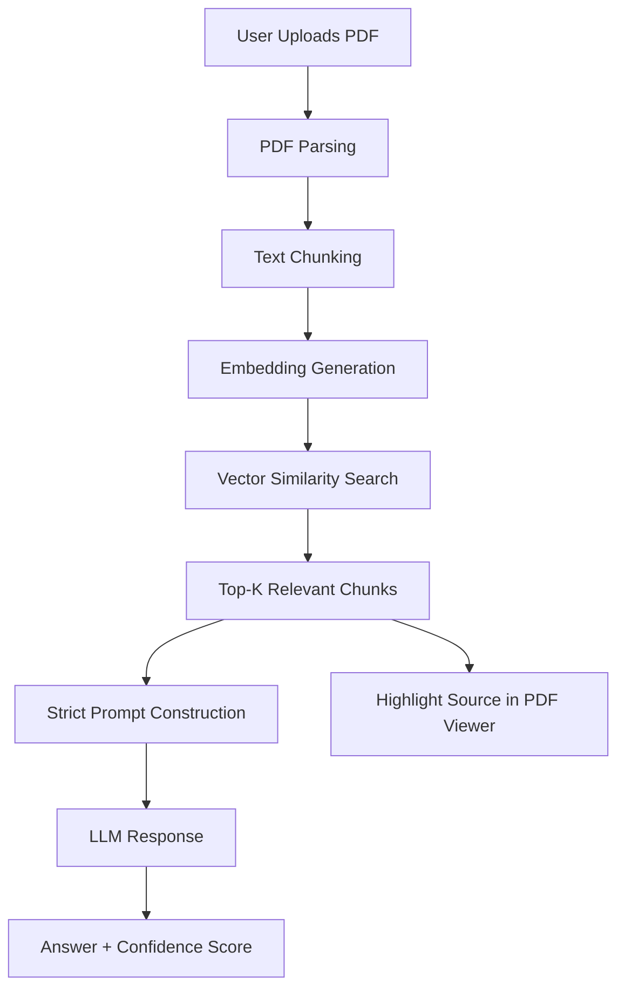

# **PrivateDoc AI**
### A document-grounded AI assistant built with Next.js 16 and Retrieval-Augmented Generation (RAG).
## Live Demo
link;
## Problem
Modern LLM-based tools such as OpenAI's ChatGPT or Google’s Gemini are powerful, but when used for document Q&A they often:
* Hallucinate answers
* Use outside knowledge
* Cannot guarantee document grounding
* Store user data
* Fail to provide source traceability
  
## Solution
PrivateDoc AI solves this by:
* Restricting answers strictly to uploaded document
* Returning a fallback if answer is not present
* Highlighting source text inside the PDF
* Avoiding document storage
* Providing controlled retrieval

## System Architecture

## Architecture Overview

| Layer        | Technology Used            | Purpose                          |
|-------------|----------------------------|----------------------------------|
| Frontend    | Next.js 16 (App Router)    | UI + Routing                     |
| Styling     | Tailwind CSS               | Modern SaaS UI                   |
| PDF Viewer  | PDF.js / react-pdf         | Document rendering               |
| Markdown    | ReactMarkdown              | Response formatting              |
| Backend     | Custom RAG Pipeline        | Controlled retrieval             |
| Embeddings  | Gemini / Groq API          | Vector representation            |
| Retrieval   | Top-K Similarity Search    | Relevant context filtering       |

## RAG Pipeline Design

### 1. Chunking Strategy
* Fixed-size chunks with overlap
* Preserves semantic boundaries
* Optimized for embedding efficiency

### 2. Embeddings
* Generated using Gemini / Groq APIs
* Stored temporarily in memory (not persisted)

### 3. Retrieval
* Cosine similarity search
* Top-k relevant chunks selected
* Strict filtering to avoid noise

## 4. Prompt Constraint Layer
The LLM receives:
* Only retrieved chunks
* Explicit instruction:
 * “Answer strictly from context.”
 * “If not found, return: The document does not contain this information.”

## Core Features
* Upload any PDF
* Automatic document summary
* 3 context-aware suggested questions
* Custom question support
* Strict grounded answers
* No hallucination policy
* Confidence score
* Highlight exact source text
* Independent scroll UX
* Clean SaaS dashboard UI
* Zero document storage

## How It’s Different from ChatGPT
| Feature                | ChatGPT | PrivateDoc AI |
|------------------------|---------|---------------|
| Grounded to document   | ❌      | ✅            |
| Hallucination fallback | ❌      | ✅            |
| Source highlighting    | ❌      | ✅            |
| Controlled RAG         | ❌      | ✅            |
| No document storage    | ❌      | ✅            |

## Local Setup
```Bash
npm install
npm run dev
```
## Environment Variables
Create a ```.env.local``` file:
```Code
GOOGLE_API_KEY=your_key
```

## Example Fallback Behavior
If a question is asked that is not present in the document:
> Response:
"The document does not contain this information."
This ensures:
* Zero hallucination
* Strict grounding
* Predictable enterprise behavior

## Future Improvements
* Persistent vector database (optional secure mode)

* Multi-document querying

* Role-based access control

* Citation export

* Enterprise deployment mode

## Author

**Rohan Sharma**
